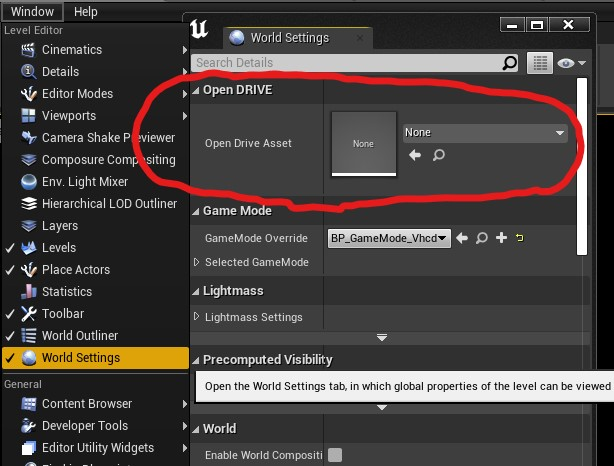
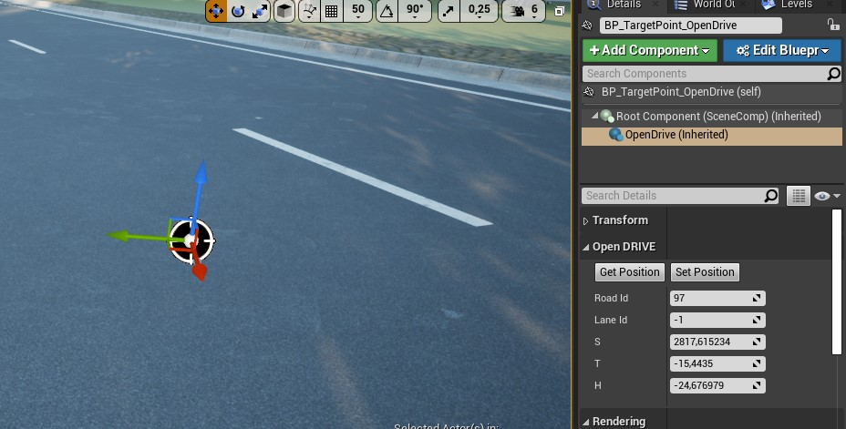
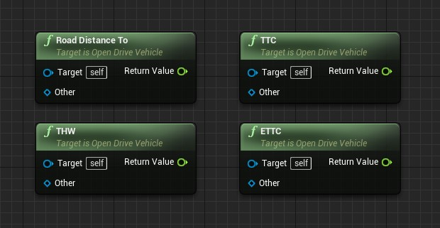
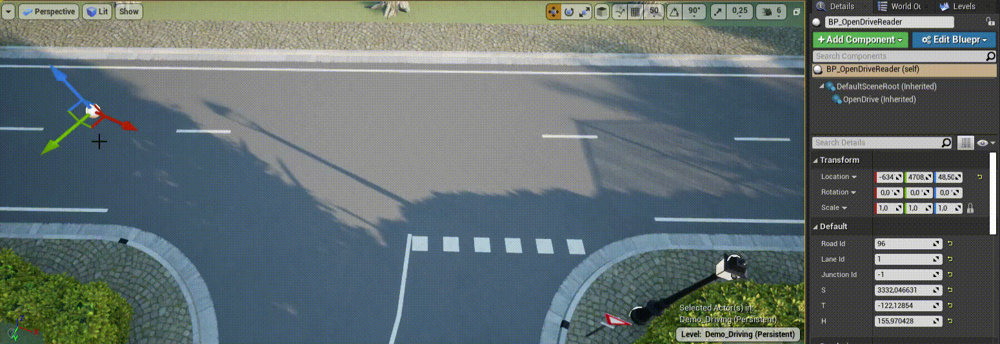
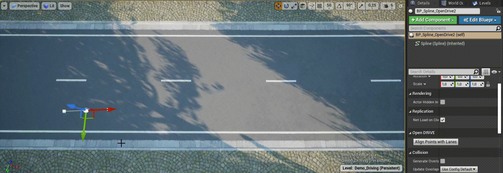
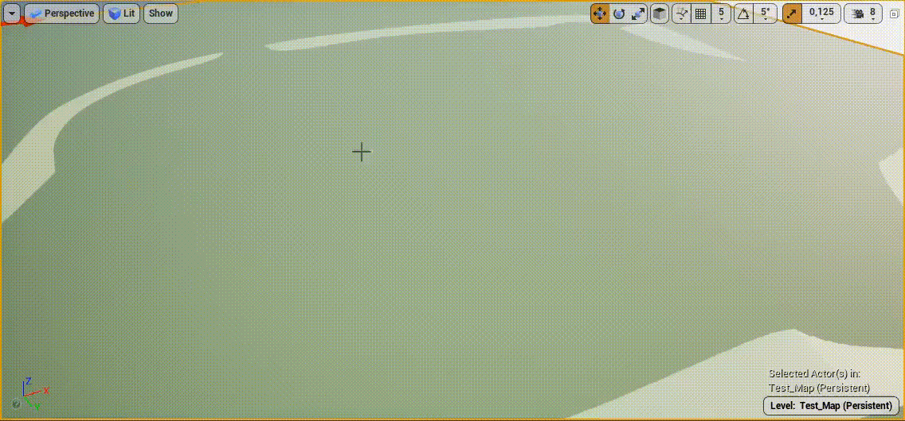

# Unreal Engine OpenDRIVE plugin

This plugin allows you to manipulate your [OpenDRIVE](https://www.asam.net/standards/detail/opendrive/) road network in Unreal Engine. It is built around [esmini](https://github.com/esmini/esmini)'s [RoadManager](https://github.com/esmini/esmini/tree/master/EnvironmentSimulator/Modules/RoadManager), which does most of the heavy work. I encourage you to check out this project, which also includes [OpenSCENARIO](https://www.asam.net/standards/detail/openscenario/) support.

## Installation

`RoadManager` is included as a submodule to this repository, so make sure to initialize and update submodules. For example:
```
git clone --recurse-submodules git@github.com:brifsttar/OpenDRIVE.git
```

## How to use

There are a few steps to follow before jumping into the features.

### Import the OpenDRIVE file

The plugin adds a new `OpenDRIVE` asset type, meaning you can (and should) import your `.xodr` file into the engine. The import process is similar to all other types of assets, so the [official documentation](https://docs.unrealengine.com/4.27/en-US/WorkingWithContent/Importing/HowTo/) should be able to guide you.

### Change your default World Settings class

Since OpenDRIVE files are tightly linked to their related scenes, the current workflow is to set the OpenDRIVE asset used for each world/level. To do that, you have to use the plugin's own `World Settings` class.

This is done by adding the following to your `DefaultEngine.ini`.

```ini
[/Script/Engine.Engine]
WorldSettingsClassName=/Script/OpenDRIVE.OpenDriveWorldSettings
```

### Add the OpenDRIVE file to your level

Once you've set the plugin `World Settings` class as default, you can open or create a level, and set its `OpenDRIVE Asset` via a property in the [World Settings](https://docs.unrealengine.com/4.27/en-US/Basics/Levels/WorldSettings/) tab.



Once that is done, your OpenDRIVE file should be properly loaded, and you can start using the plugin's features, or add your own using the full power of [esmini](https://github.com/esmini/esmini)'s [RoadManager](https://github.com/esmini/esmini/tree/master/EnvironmentSimulator/Modules/RoadManager).

## Features

### OpenDRIVE Component



The OpenDRIVE component can be attached to any actor to get or set its position on OpenDRIVE's track coordinate. It also interfaces some basic OpenDRIVE functions to Blueprint.

### OpenDRIVE Vehicle Component



The OpenDRIVE Vehicle component can be attached to `WheeledVehicle` and provides some metrics commonly used in driving simulation.

### OpenDRIVE Reader



This small editor Blueprint actor automatically updates its track coordinate when moved around the scene, making road and junction identification much easier.

### OpenDRIVE Spline



A basic spline with an added feature to align all spline point to their lane center. Useful to create car trajectories.

### Junction Spawner


This Blueprint can spawn any actor (usually signs or traffic lights) for all roads incoming to a junction. You can also set offsets on the sign's track coordinate.

No signs (or any prop) are included in this plugin. But you can check out [Der Sky](https://www.unrealengine.com/marketplace/en-US/profile/Der+Sky)'s Marketplace products, which probably has what you need.

### Landscape Sculpting



This Editor Utility Blueprint automatically sculpts your selected landscapes based on your OpenDRIVE roads. You can set the falloff, the height offset and the layer to paint under roads.

**This feature doesn't include drawing the actual road network**, it only sculpts the landscape to perfectly fit along the roads. In the video above, the road network was generated using [RoadRunner](https://www.mathworks.com/products/roadrunner.html)

Known limitations:

*  Sculpting can miss parts of the landscape in junctions, leaving spikes. Those can be manually removed with standard sculpting tools
* Layer painting won't remove foliage from the previous layer. It seems to be an Unreal Engine bug, and the current workaround is to manually apply a single paint touch to each landscape grid unit, which will instantly remove all foliage on painted roads for that grid unit.
